# HashiCorp Vault — Secret Manager Integration

> **Premium Feature** — Requires a **Pro** or **Ultimate** license.
> [View Bruno pricing](https://www.usebruno.com/pricing)

This collection demonstrates how to use [HashiCorp Vault](https://www.vaultproject.io/) as a secret manager inside Bruno. Secrets fetched from Vault are available across all requests in this collection (see `echo-bru`) via the `$secrets` syntax.

---

## Prerequisites

- Bruno **Pro** or **Ultimate** license
- HashiCorp Vault installed locally (instructions below)

---

## Step 1 — Install & Start Vault

### Windows

Run in **PowerShell** or **Command Prompt** (requires [Chocolatey](https://chocolatey.org/)):

```powershell
choco install vault
vault server -dev
```

### macOS

Run in **Terminal**:

```bash
brew tap hashicorp/tap
brew install hashicorp/tap/vault
vault server -dev
```

> After the server starts, the terminal will print a **Root Token** and confirm the server is listening at `http://127.0.0.1:8200`. Keep this terminal open — copy the Root Token, you will need it in the next steps.

---

## Step 2 — Create a Secret in Vault

1. Open `http://127.0.0.1:8200` in your browser. You will see the **Sign in to Vault** page. Select **Token** as the method, paste your Root Token, and click **Sign in**.

   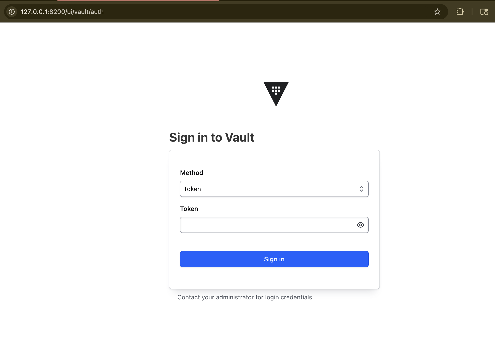

2. After logging in, you land on the Dashboard. Under **Secrets engines**, click **secret/** (key/value secret storage).

   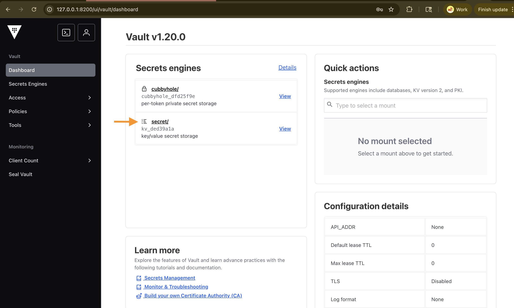

3. You will see the list of existing secrets. Click **Create secret +** in the top-right corner.

   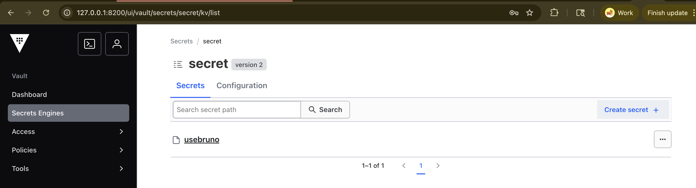

4. Fill in the **Create Secret** form:
   - **Path for this secret** — enter a path name, e.g. `usebruno`
   - **Secret data** — enter a key (e.g. `usebruno`) and its value, then click **Add**

   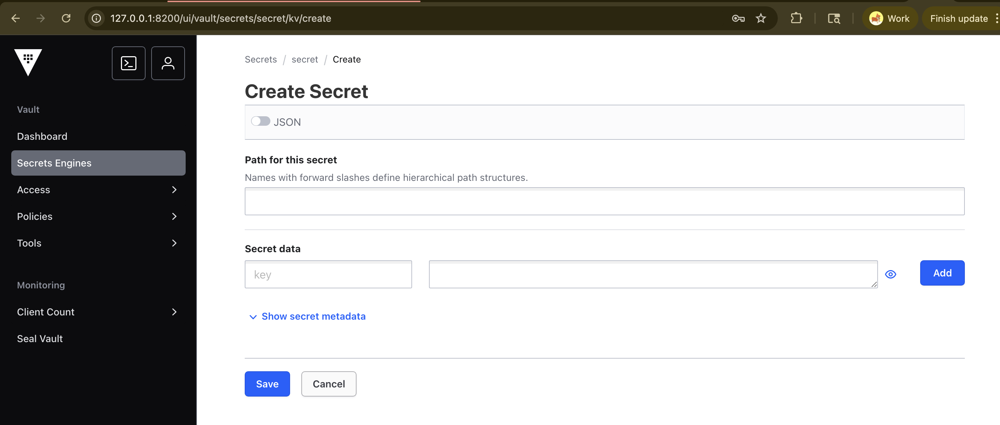

5. Click **Save**. The secret detail page will confirm the secret was created. Note the **API path** shown (e.g. `/v1/secret/data/usebruno`) — you will use this path in Bruno.

   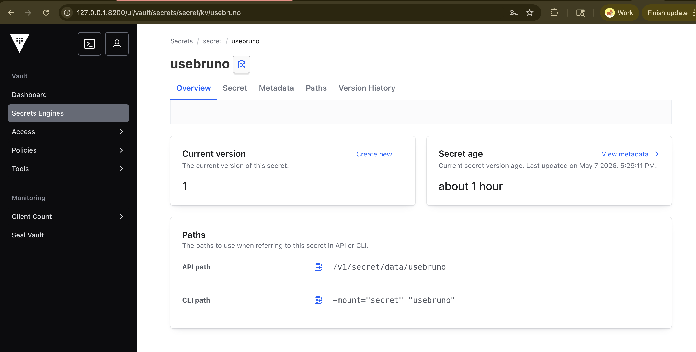

---

## Step 3 — Add Vault as a Secret Provider in Bruno

1. Open Bruno and click the **Preferences** icon in the bottom-left corner.
2. Go to the **Secret Manager** tab.
3. Click **Add Secret Provider** — an **Edit Provider** dialog will open.
4. Fill in the fields **one by one** in this order:
   - **Name** — enter a label for this provider, e.g. `HashiCorp Vault`
   - **Secret Manager** — select **Vault Server** from the dropdown
   - **URL** — enter `http://127.0.0.1:8200/`
   - **Namespace** — leave empty for local dev (used for Vault Enterprise namespaces only)
   - **Auth Method** — select **Token** from the dropdown
   - **Token** — paste the Root Token copied from your terminal

   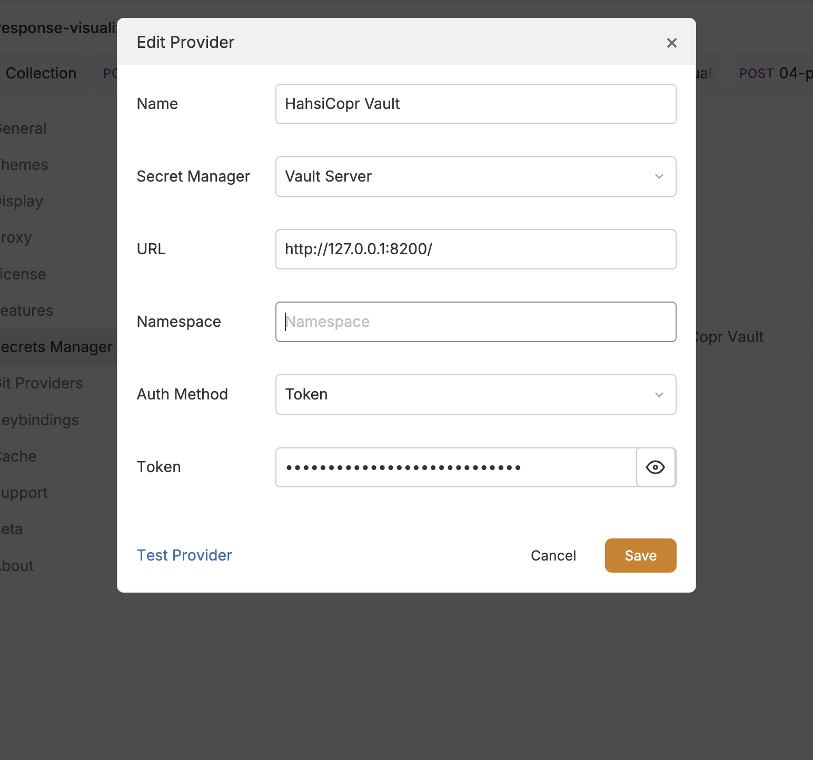

5. Click **Test Provider** — you should see a **"Test service provider working fine"** confirmation.
6. Click **Save**.

---

## Step 4 — Configure the Collection to Use Vault

1. Open the **Collection** tab at the top and click on **Secrets**.
2. From the provider dropdown, select **Vault**.

   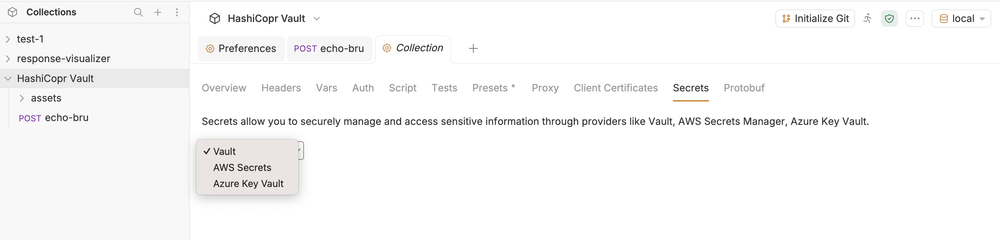

3. A row will appear in the **Vault Secrets Provider** table. Fill in:
   - **Name** — the secret name, e.g. `usebruno`
   - **Path** — must start with `secret/`, e.g. `secret/data/usebruno`

   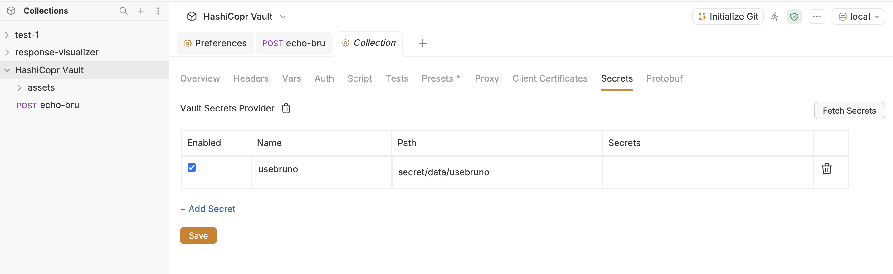

4. Click **Save**.

---

## Step 5 — Fetch Secrets

1. Click the **Fetch Secrets** button in the top-right of the Secrets tab.
2. A **Fetch Secrets** dialog will appear. Select your Vault provider (e.g. `HahsiCopr Vault`) from the **Provider** dropdown.

   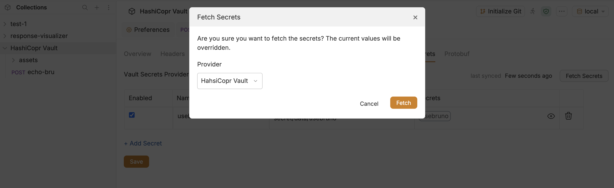

3. Click **Fetch**. The secrets are pulled automatically and the **Secrets** column in the table will populate with the fetched secret keys.

   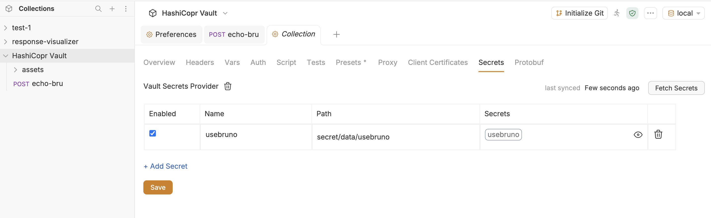

---

## Using Secrets in Requests

Once fetched, secrets are available everywhere inside the collection using the pattern:

```
$secrets.<secret-name>.<key-name>
```

### In request body / headers / query params (template syntax)

```json
{
  "title": "{{$secrets.usebruno.usebruno}}"
}
```

The `echo-bru` request in this collection already demonstrates this — the secret value is resolved at runtime and returned in the response:

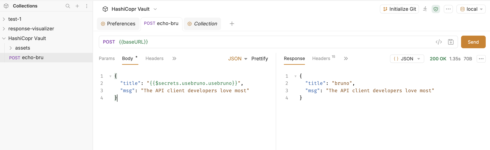

### In Pre-request / Post-request scripts

```javascript
const apiKey = bru.getSecretVar('usebruno.api-key');
req.setHeaders('x-api-key: ' + apiKey);
```

---

## Further Reading

- [Using secrets in Bruno](https://docs.usebruno.com/secrets-management/secret-managers/hashicorp-vault/using-secrets)
- [HashiCorp Vault overview (Bruno docs)](https://docs.usebruno.com/secrets-management/secret-managers/hashicorp-vault/overview)
