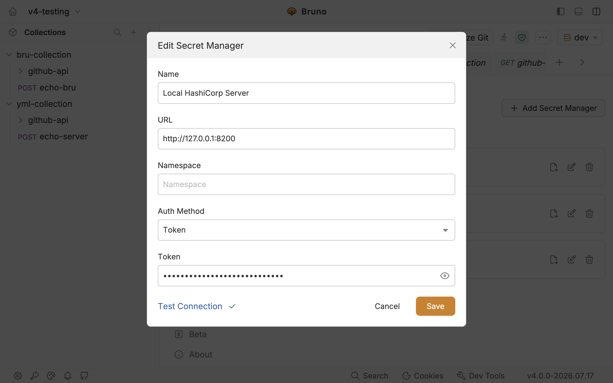
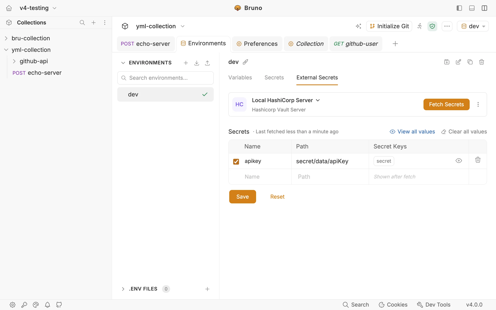
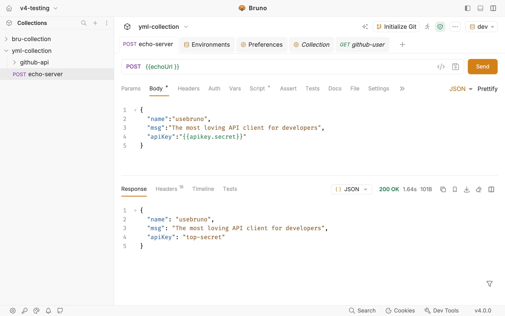

# HashiCorp Vault — Bruno v4 Integration

> **Premium feature:** HashiCorp Vault integration requires a Bruno **Pro** or
> **Ultimate** license. [View Bruno pricing](https://www.usebruno.com/pricing).

This collection demonstrates how to retrieve secrets from a local HashiCorp
Vault server in Bruno v4.

## What changed in Bruno v4?

- Secret mappings moved from **Collection → Secrets** to
  **Environment → External Secrets**.
- Configuration is stored in each environment file under `externalSecrets`;
  Bruno no longer reads the collection-level `secrets.json`.
- The recommended request-field syntax is now `{{secret-name.key-name}}`.
- The legacy `{{$secrets.secret-name.key-name}}` syntax still works in v4, but
  is deprecated and will be removed in the next major release.

## Prerequisites

- Bruno v4 with a **Pro** or **Ultimate** license
- HashiCorp Vault installed locally
- An environment selected in Bruno, such as `local`

## Step 1 — Install and start Vault

### Windows

Run in PowerShell or Command Prompt. This requires
[Chocolatey](https://chocolatey.org/).

```powershell
choco install vault
vault server -dev
```

### macOS

Run in Terminal:

```bash
brew tap hashicorp/tap
brew install hashicorp/tap/vault
vault server -dev
```

Vault prints a **Root Token** and starts the development server at
`http://127.0.0.1:8200`. Keep this terminal open and copy the token.

> Development mode stores data in memory and is not suitable for production.

## Step 2 — Create a secret in Vault

1. Open `http://127.0.0.1:8200`, select **Token**, paste the Root Token, and
   click **Sign in**.
2. Under **Secrets engines**, open the `secret/` key/value store.
3. Click **Create secret +**.
4. Enter a path such as `usebruno` or `apiKey`, then add a key and value.
5. Click **Save**. For the `apiKey` example, the path used in Bruno is
   `secret/data/apiKey`. Do not include the `/v1/` API prefix.

## Step 3 — Add the Vault account in Bruno

1. Open **Preferences → Secrets Manager**.
2. Click **+ Add Secret Manager**.
3. Select **HashiCorp Vault Server**.
4. Configure the account:
   - **Name:** `Local HashiCorp Server`
   - **URL:** `http://127.0.0.1:8200`
   - **Namespace:** leave empty for a local development server
   - **Auth Method:** **Token**
   - **Token:** paste the Root Token printed by Vault
5. Click **Test Connection**.
6. Click **Save** to store the account.



Bruno v4 also supports **AppRole** and **LDAP** authentication. Token
authentication is the simplest choice for this local development example;
AppRole is generally more appropriate for automation and CI/CD.

## Step 4 — Configure External Secrets for an environment

Starting in v4, this configuration belongs to an environment rather than the
collection.

1. Select the environment from the environment selector.
2. Open the environment editor.
3. Go to **External Secrets**.
4. Select **HashiCorp Vault Server**.
5. Select the Vault account created in Step 3.
6. Add the secret mapping:
   - **Name:** `apikey`
   - **Path:** `secret/data/apiKey`
   - **Enabled:** on
7. Save the environment.



The equivalent environment YAML is:

```yaml
name: local
variables:
  - name: baseURL
    value: https://echo.usebruno.com
externalSecrets:
  type: hashicorp-vault-server
  variables:
    - name: apikey
      path: secret/data/apiKey
      enabled: true
```

Each Bruno environment has its own `externalSecrets` block, so development,
staging, and production can use different Vault accounts and paths.

## Step 5 — Fetch secrets

1. Open **Environment → External Secrets**.
2. Click **Fetch Secrets** in the top-right corner.
3. Verify that the fetched keys and values appear in the **Secret Keys**
   column.

Fetching again replaces the current fetched values.

## Use secrets in requests

External secrets can be referenced in request URLs, headers, query parameters,
bodies, and authentication fields.

### Recommended Bruno v4 syntax

```json
{
  "name": "usebruno",
  "msg": "The most loving API client for developers",
  "apiKey": "{{apikey.secret}}"
}
```

The pattern is:

```text

```



### Legacy syntax

The following syntax still resolves in Bruno v4, but it is deprecated:

```text
{{$secrets.apikey.secret}}
```

Bruno underlines legacy references in the editor. Update them to the v4 syntax
before the next major release.

### Pre-request and post-request scripts

The script API remains unchanged:

```javascript
const value = bru.getSecretVar('apikey.secret');
req.setHeader('x-api-key', value);
```

## Migrating an existing pre-v4 collection

1. Ensure `secrets.json` is writable.
2. Open the collection in the Bruno v4 app.
3. Bruno automatically migrates its configuration into the relevant
   environment file.
4. Verify the mappings under **Environment → External Secrets**.
5. Replace `{{$secrets.name.key}}` references with `{{name.key}}`.
6. Commit the updated environment file.
7. After verification, delete the obsolete `secrets.json`.

The Bruno CLI does not perform this migration. Open the collection in the app
first. If the CLI finds `secrets.json` without a migrated `externalSecrets`
block, it warns and continues without those secrets.

## CLI and CI

Export a configured provider from **Preferences → Secrets Manager** as a
`.env` file, then pass it to the CLI:

```bash
bru run collection/ --env local --secrets-env-file ./secrets.env
```

The exported file contains credentials in plain text. Add it to `.gitignore`
and never commit it.

## Further reading

- [Bruno v4 Secret Manager migration guide](https://docs.usebruno.com/secrets-management/secret-managers/migration)
- [Add a HashiCorp Vault provider](https://docs.usebruno.com/secrets-management/secret-managers/hashicorp-vault/adding-a-secret-provider)
- [Configure and fetch Vault secrets](https://docs.usebruno.com/secrets-management/secret-managers/hashicorp-vault/configuring-and-fetching-secrets)
- [Use Vault secrets](https://docs.usebruno.com/secrets-management/secret-managers/hashicorp-vault/using-secrets)
